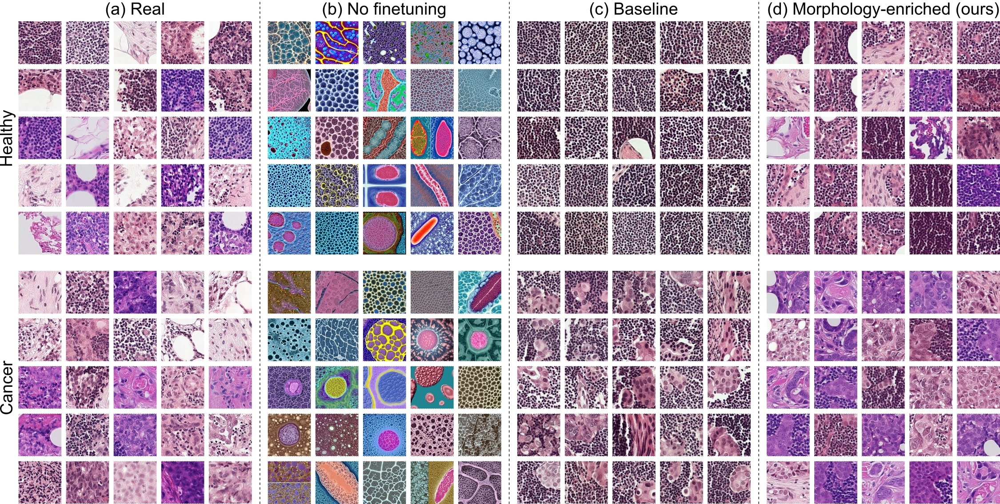
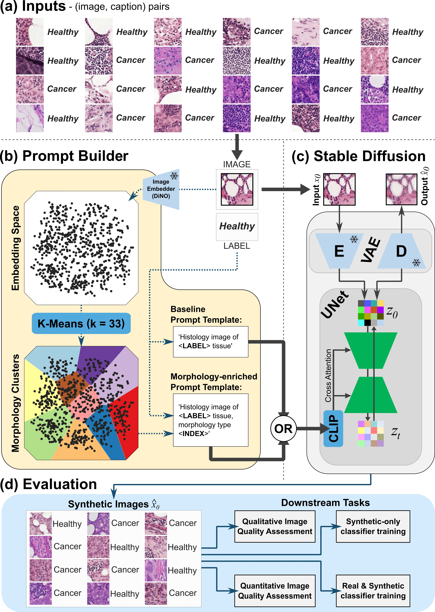

# MEP-LDM : <ins>M</ins>orphology-<ins>E</ins>nriched <ins>P</ins>rompt-building
[](https://www.mozilla.org/en-US/MPL/2.0/)
[](https://github.com/ambv/black)



MEP is a semi self-supervised approach for training text-conditioned image generative models. We explore its applicability for finetuning a large pretrained LDM (i.e. Stable Diffusion (SD), [1.5 version](https://huggingface.co/runwayml/stable-diffusion-v1-5)) and evaluate it against a class conditional baseline.

This is a PyTorch/GPU implementation of the paper Latent Diffusion Models with Image-Derived Annotations for Enhanced AI-Assisted Cancer Diagnosis in Histopathology (link [here](https://www.mdpi.com/2075-4418/14/13/1442)):

```
@Article{diagnostics14131442,
AUTHOR = {Osorio, Pedro and Jimenez-Perez, Guillermo and Montalt-Tordera, Javier and Hooge, Jens and Duran-Ballester, Guillem and Singh, Shivam and Radbruch, Moritz and Bach, Ute and Schroeder, Sabrina and Siudak, Krystyna and Vienenkoetter, Julia and Lawrenz, Bettina and Mohammadi, Sadegh},
TITLE = {Latent Diffusion Models with Image-Derived Annotations for Enhanced AI-Assisted Cancer Diagnosis in Histopathology},
JOURNAL = {Diagnostics},
VOLUME = {14},
YEAR = {2024},
NUMBER = {13},
ARTICLE-NUMBER = {1442},
URL = {https://www.mdpi.com/2075-4418/14/13/1442},
PubMedID = {39001331},
ISSN = {2075-4418},
DOI = {10.3390/diagnostics14131442}
}
```

# Installation

If you need to create a new Conda environment for the project, you can do so via:

```bash
make env
```

and then install the project using pip by running the following commands after cloning the repository.

```bash
make install
```

# Usage

Our implementation relies on [OmegaConf](https://omegaconf.readthedocs.io/en/2.3_branch/) and [Hydra](https://hydra.cc/docs/intro/) to manage the configurations for running the multiple steps of our pipeline. Have a look in *src/biogen/cli.py* to understand which functionalities it is possible to run from the terminal using the *biogen* command prefix. 

Below you can find a step by step guide for running our proposed prompt building pipeline, stable-diffusion fine-tuning, image generation and image quality evaluation.s

## Prepraration

In order to use our code on your data you need to ensure that you have both an image and a DiNO embedding version of your training dataset. Our experiments relied on the open source PatchCam, you can download it via the Kaggle API [here](https://www.kaggle.com/competitions/histopathologic-cancer-detection).

Our dataset structure in this work follows Hugging Face's (HF) datasets library. We need to have both the image and the DiNO embedding datasets in this format. You can read more details about how to build these datasets [here](https://huggingface.co/docs/datasets/en/index). An example of the correct image data structure is provided under the test assets: example_data/histopathology/image

We include in our codebase the functionality to convert an image HF dataset, into a DiNO embedding one:

```bash
biogen dataset-to-tokens \
dataset2tokens.dataset_name=histopathology \
dataset2tokens.path=example_data \
dataset2tokens.label_key=label # if dataset contains labels otherwise None
```

## Morphology-enriched prompt building (MEP)



### Prompt Building

Create the prompt for a given dataset. Create a config file under: *config/pb/dataset* with the path to the desired DiNO embedding dataset. You must also specify whether to balance and how large would like your final dataset size will be. In the example below neither balancing nor multiple splits are performned during prompt building given the limited dimension of this example dataset.
``` bash
biogen build-prompts \
pb/dataset=test-dinov1-histopathology \
pb/strategy=mep-histo \
pb/balancing=test-balancing \
pb.outputformat.single_split=True \
pb.outputformat.save_path=example_data/histopathology \
pb.outputformat.experiment_name=testing-prompted-metadata
```
Alternatively, specify the path to your DiNO emebedding dataset like so:
``` bash
biogen build-prompts \
pb.dataset.ds_path=example_data/histopathology/token/train \
pb/strategy=mep-histo \
pb/balancing=test-balancing \
pb.outputformat.single_split=True \
pb.outputformat.save_path=example_data/histopathology \
pb.outputformat.experiment_name=testing-prompted-metadata
```

### Create file structure expected by SD fine-tuning script:
Once the metadata has been generated we must use it to create a image folder structure that the SD finetuning script can read as a HF dataset.
```bash
biogen create-file-structure \
create_fs.experiment_name=testing-prompted-metadata \
create_fs.data_path=example_data/histopathology
```
Alternatively define a custom config file under: *config/create_fs*. See example:

``` bash
biogen create-file-structure create_fs=testing
```

In our work, the baseline set using only the binary label from PCam was achieved by copying and removing the morphological cluster information from the prompts of the dataset we get at this point in the pipelin. 

## Fine-tuning SD
Now with the prompted dataset in the correct format under a known path we can run the training by:

Configuring *accelerate*:
```bash
accelerate config
```
and then fine-tuning the LDM using:
```bash
export DIR_WITH_TRAINING_DATA="example_data/histopathology/testing-prompted-metadata/dataset_balanced/image"
export DIR_WHERE_TO_SAVE_MODEL="example_data/histopathology/testing-prompted-metadata/dataset_balanced/model/ckpts"

accelerate launch --mixed_precision="fp16" --multi_gpu scripts/train_text_to_image.py \
  --pretrained_model_name_or_path="runwayml/stable-diffusion-v1-5" \
  --train_data_dir=$DIR_WITH_TRAINING_DATA \
  --allow_tf32 \
  --use_8bit_adam \
  --enable_xformers_memory_efficient_attention \
  --resolution=512 \
  --random_flip \
  --train_batch_size=1 \
  --gradient_accumulation_steps=1 \
  --gradient_checkpointing \
  --max_train_steps=15 \
  --checkpointing_steps=500 \
  --learning_rate=1e-05 \
  --max_grad_norm=1 \
  --lr_scheduler="constant" --lr_warmup_steps=0 \
  --output_dir=$DIR_WHERE_TO_SAVE_MODEL
```

This script is the exact one from [diffusers](https://github.com/huggingface/diffusers). Have a look at this [guide](https://github.com/huggingface/diffusers/tree/main/examples/text_to_image) for more information about how to run this script and all of its features.

Please change the training hyperparameters according to what your setup allows. The current batch size, number of training steps and gradient accumulation steps is set to a minimum to enable training on our limited T4 set up.


## Image generation

Prompt-wise image generation is achieved via running the command below. We use [Ray](https://github.com/ray-project/ray) for parallelising the image generation process across the multiple available GPUs.

```bash
biogen generate-image-sd \
image_gen.model_path=       # [PATH TO THE FOLDER WITH THE MODEL WEIGHTS AND COMPONENTS] \
image_gen.prompt_dict_path= # [PATH TO THE JSON DICTIONARY WITH THE PROMPTS YIELDED BY THE PROMPT BUILDING PIPELINE] \
image_gen.ckpt=             # [INT DETERMINING THE CKPT TO USE. IF NONE THE LAST ONE IS SELECTED] \
image_gen.save_im_path=     # [PATH WHERE TO SAVE THE FINAL SYNTHETIC DATASET]
```

Additionally, it is possible to regulate the number of generated examples per prompt (N<sub>per prompt</sub>) via the *image_gen.n_batch* and *image_gen.num_images_batch* arguments, where N<sub>per prompt</sub> = n_batch * num_images_batch. Look into the config files under *config/image_gen* for more details. You can also configure your generation parameters by creating a config file under taht directory. See example:

```bash
biogen generate-image-sd image_gen=test-generation
```

This example command will save a syntehtic dataset under: 

*example_data/histopathology/testing-prompted-metadata/dataset_balanced/model/images-ckpt-last/image*

## Image Evaluation

We can evaluate the final synthetic with the FID and Precision & Recall metrics via the following command:

```bash
biogen evaluate-synthetic-dataset \
evaluation.real_image_data_path=example_data/histopathology/testing-prompted-metadata/dataset_balanced/image \
evaluation.synthetic_image_data_path=example_data/histopathology/testing-prompted-metadata/dataset_balanced/model/images-ckpt-last/image \
evaluation.token_type=inceptionv3_tokens
```
Alternatively define a custom config file under: *config/evaluation*. See example:
```bash
biogen evaluate-synthetic-dataset evaluation=test-eval
```

# Additional example:

## CXR data wo/ labels

See this additional example of the full pipeline being ran for a small subset (N=150) of the [RSNA Pneumonia Detection Challenge](https://www.rsna.org/education/ai-resources-andtraining/ai-image-challenge/RSNA-Pneumonia-Detection-Challenge-2018)

Data download link: [RSNA Pneumonia Detection Challenge (JPG files)](https://academictorrents.com/details/95588a735c9ae4d123f3ca408e56570409bcf2a9).

License: [Pneumonia Detection Challenge Terms of Use and Attribution](https://www.rsna.org/-/media/Files/RSNA/Education/AI-resources-and-training/AI-image-challenge/pneumonia-detection-challenge-terms-of-use-and-attribution.ashx?la=en&hash=FF7A635F6DFFAD31A30C8715DFA3B8FC21131543)

Paper Reference:
*Shih, George, et al. "Augmenting the national institutes of health chest radiograph dataset with expert annotations of possible pneumonia." Radiology: Artificial Intelligence 1.1 (2019): e180041.*

```bash
# Create DiNO emebeddings for image data
biogen dataset-to-tokens \
dataset2tokens.dataset_name=cxr-rsna \
dataset2tokens.path=example_data \
dataset2tokens.label_key=None

# Create prompts
biogen build-prompts \
pb.dataset.ds_path=example_data/cxr-rsna/token/train \
pb.dataset.label_key=None \
pb/strategy=mep-cxr \
pb/balancing=test-balancing \
pb/outlierremoval=cxr \
pb.outputformat.single_split=True \
pb.outputformat.save_path=example_data/cxr-rsna \
pb.outputformat.experiment_name=testing-prompted-metadata

# Create file structure
biogen create-file-structure \
create_fs.experiment_name=testing-prompted-metadata \
create_fs.data_path=example_data/cxr-rsna

# Fine-Tune
export DIR_WITH_TRAINING_DATA="example_data/cxr-rsna/testing-prompted-metadata/dataset_balanced/image"
export DIR_WHERE_TO_SAVE_MODEL="example_data/cxr-rsna/testing-prompted-metadata/dataset_balanced/model/ckpts"

accelerate launch --mixed_precision="fp16" --multi_gpu scripts/train_text_to_image.py \
  --pretrained_model_name_or_path="runwayml/stable-diffusion-v1-5" \
  --train_data_dir=$DIR_WITH_TRAINING_DATA \
  --allow_tf32 \
  --use_8bit_adam \
  --enable_xformers_memory_efficient_attention \
  --resolution=512 \
  --random_flip \
  --train_batch_size=1 \
  --gradient_accumulation_steps=1 \
  --gradient_checkpointing \
  --max_train_steps=15 \
  --checkpointing_steps=500 \
  --learning_rate=1e-05 \
  --max_grad_norm=1 \
  --lr_scheduler="constant" --lr_warmup_steps=0 \
  --output_dir=$DIR_WHERE_TO_SAVE_MODEL

# Generate Images
biogen generate-image-sd \
image_gen.model_path=example_data/cxr-rsna/testing-prompted-metadata/dataset_balanced/model/ckpts \
image_gen.prompt_dict_path=example_data/cxr-rsna/testing-prompted-metadata/metadata/text_2_promptidx_valid_susbet.pkl \
image_gen.ckpt=None \
image_gen.save_im_path=example_data/cxr-rsna/testing-prompted-metadata/dataset_balanced/model/images-ckpt-last/image/train \
image_gen.n_batch=1 \
image_gen.num_images_batch=5

# Evaluate Images
biogen evaluate-synthetic-dataset \
evaluation.real_image_data_path=example_data/cxr-rsna/testing-prompted-metadata/dataset_balanced/image \
evaluation.synthetic_image_data_path=example_data/cxr-rsna/testing-prompted-metadata/dataset_balanced/model/images-ckpt-last/image \
evaluation.token_type=inceptionv3_tokens
```