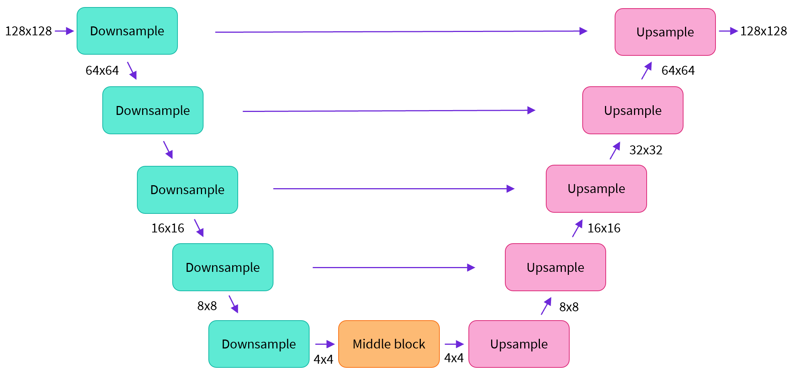

# Stable diffusion

This document describes how stable diffusion works.

```{note}
This document is based on the  {ref}`stable diffusion blog post from huggingface<stable_diffusion_hfpost>`
```

Stable Diffusion is a text-to-image latent diffusion model created by the researchers and engineers from [CompVis](https://github.com/CompVis), [Stability AI](https://stability.ai/) and [LAION](https://laion.ai/). It is trained on 512x512 images from a subset of the [LAION-5B](https://laion.ai/blog/laion-5b/) database. LAION-5B is the largest, freely accessible multi-modal dataset that currently exists.

Having seen the high-quality images that stable diffusion can produce, let's try to understand a bit better how the model functions.

Stable Diffusion is based on a particular type of diffusion model called Latent Diffusion, proposed in {ref}`High-Resolution Image Synthesis with Latent Diffusion Models<latent_diffusion_paper>`.

Generally speaking, diffusion models are machine learning systems that are trained to denoise random Gaussian noise step by step, to get to a sample of interest, such as an image. For a more detailed overview of how they work, check this colab.

Diffusion models have shown to achieve state-of-the-art results for generating image data. But one downside of diffusion models is that the reverse denoising process is slow because of its repeated, sequential nature. In addition, these models consume a lot of memory because they operate in pixel space, which becomes huge when generating high-resolution images. Therefore, it is challenging to train these models and also use them for inference.

Latent diffusion can reduce the memory and compute complexity by applying the diffusion process over a lower dimensional latent space, instead of using the actual pixel space. This is the key difference between standard diffusion and latent diffusion models: in latent diffusion the model is trained to generate latent (compressed) representations of the images.

## Model Architecture

There are four main components in latent diffusion:

1. An **autoencoder (VAE)** that compresses the input images into a latent space.
2. A **U-Net** that learns how to reverse the diffusion process so we can generate images from gaussian noise.
3. A **text-encoder**, e.g. CLIP's Text Encoder to create context embeddings used to guide the image generation process.
4. A **noise scheduler** that defines the diffusion process to transform noise into images.

### The autoencoder (VAE)

The VAE model has two parts, an encoder and a decoder. The encoder is used to convert the image into a low dimensional latent representation, which will serve as the input to the U-Net model. The decoder, conversely, transforms the latent representation back into an image.

During latent diffusion training, the encoder is used to get the latent representations (latents) of the images for the forward diffusion process, which applies more and more noise at each step. During inference, the denoised latents generated by the reverse diffusion process are converted back into images using the VAE decoder. As we will see during inference we only need the VAE decoder.

### The U-Net

The U-Net has an encoder part and a decoder part both comprised of ResNet blocks. The encoder compresses an image representation into a lower resolution image representation and the decoder decodes the lower resolution image representation back to the original higher resolution image representation that is supposedly less noisy. More specifically, the U-Net output predicts the noise residual which can be used to compute the predicted denoised image representation.

:::{figure-md} unet-overview
:class: unet-overview



U-Net architecture: Each block reduces/upscales the image by a factor of 2. In stable diffusion, each attention block is conditioned on the text embeddings.
:::

To prevent the U-Net from losing important information while downsampling, short-cut connections are usually added between the downsampling ResNets of the encoder to the upsampling ResNets of the decoder. Additionally, the stable diffusion U-Net is able to condition its output on text-embeddings via cross-attention layers. The cross-attention layers are added to both the encoder and decoder part of the U-Net usually between ResNet blocks.

:::{figure-md} unet-detail
:class: unet-detail


Detail of the different blocks that are part of the Unet architecture for a segmentation task. Image from the {ref}`original U-Net paper<unet_paper>`
:::

### The Text-encoder

The text-encoder is responsible for transforming the input prompt, e.g. "An astronaut riding a horse" into an embedding space that can be understood by the U-Net. It is usually a simple transformer-based encoder that maps a sequence of input tokens to a sequence of latent text-embeddings.

Inspired by Imagen, Stable Diffusion does not train the text-encoder during training and simply uses an CLIP's already trained text encoder, CLIPTextModel.

### The noise scheduler

The U-Net iteratively denoises the random latent image representations while being conditioned on the text embeddings. The output of the U-Net, being the noise residual, is used to compute a denoised latent image representation via a scheduler algorithm. Many different scheduler algorithms can be used for this computation, each having its pro- and cons. For Stable Diffusion, we recommend using one of:

* PNDM scheduler (used by default)
* DDIM scheduler
* K-LMS scheduler

## The diffusion process

The (forward) diffusion process consists in gradually adding noise to the image latents until they are indistinguishable from gaussian noise.

This is an iterative process where an small amount of gaussian noise is added to the latents each step.

```{note}
By convention, we take T steps during the whole process. t=0 corresponds to the original image and t=T corresponds to gaussian noise. So going from t0 --> t1 means adding noise and going from t1 --> t0 means removing noise.
```

The diffussion process is described a an stochastic differential equation (SDE). The specific SDE solved
when generating images will depend on the scheduler, although usually the network predicts the noise term and the scheduler uses it to integrade the SDE that defines the reverse process.

:::{figure-md} inference-sd
:class: inference-sd


This figure describes the SDE used on the DDPM scheduler (Original implementation that required thousands of steps to generate an image)
:::

## Inference

TODO

:::{figure-md} inference-sd
:class: inference-sd


Inference process for generating an image from gaussian noise in the latent space. Image from the {ref}`hf stable diffusion blogpost<stable_diffusion_hfpost>`
:::

## Training

### U-Net

:::{figure-md} inference-sd
:class: inference-sd


The U-Net is trained to reverse one step of the diffusion process at a time. Image from the {ref}`latent diffusion paper<latent_diffusion_paper>`
:::

This section describes the process of training the U-Net so it learns to reverse the noise diffusion process.
The goal is training the U-Net to learn to reverse one step of the diffusion process at a time, given the
noisy latents, and the current time step of the diffusion process.

During the training, both the weghts of language model and the autoencoder are frozen, and only the U-Net is trained.

The U-Net learns to reverse the diffusion process one step at a time. Given that the amount of noise in any
given step of the diffusion process can be calculated analitically, each training step is done on a
single time step of the diffusion process sampled at random.

```{note}
* The U-Net only has access to latent representations of images. 

* During training, only the encoder of the VAE is used to generate latents. The VAE is not trained, and 
the latents predicted by the U-Net are never decoded because the training loss only depends on latent representations.

* The goal of the U-Net is navigating the latent space from pure noise to meaningful latents that can be decoded by the VAE.

```

### Training loop

1. **Preprocess inputs**:
   * Encode Image to latent space.
   * Get text embeddings from the text prompt.
2. **Sample random noise**, and **choose a diffusion process timestep** at random.
3. **Produce a noisy image** providing the scheduler with the latents, random noise, and the timestep as inputs.
4. **The U-Net predicts the noise sampled at step 2)** taking the noisy images as input.
5  Minimize **MSE between the U-Net output and the true noise value**.

```{note}
* The noise that the network predicts is the N(0, 1) noise sampled at step b) 

* The scheduler scales the noise (depending on the timestep) to produce the noisy image .

* The U-Net reverses the noise scaling process of the scheduler .
```

### Autoencoder training

In stable diffusion, the architecture of the autoencoder corresponds to the one described in {ref}`Auto-Encoding variational Bayes<vae_architecture>`,
although it is trained like a {ref}`VQGAN<vae_training>`.

If you want to understand how VQGANs work take a look at {ref}`this blogpost<vq_gan_post>`.

:::{figure-md} inference-sd
:class: inference-sd


The autoencoder is trained to learn discrete latent codes that can be used to reconstruct the image. Image from the {ref}`VQGAN paper<vae_training>`
:::
