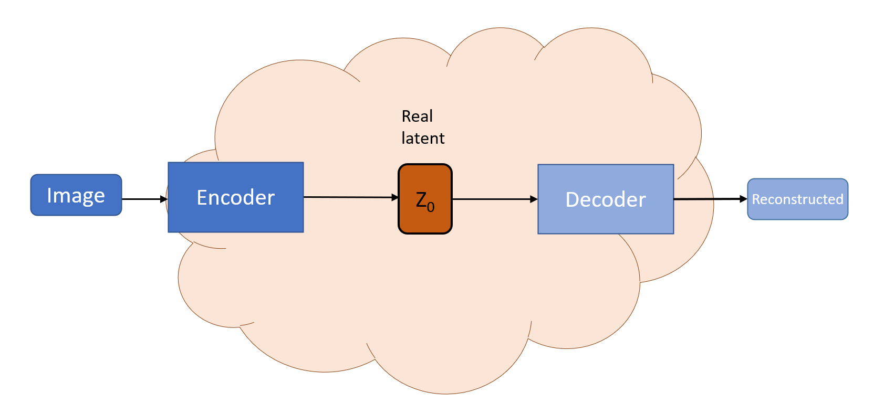
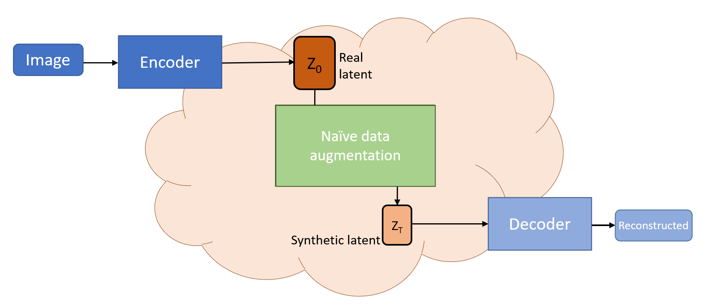
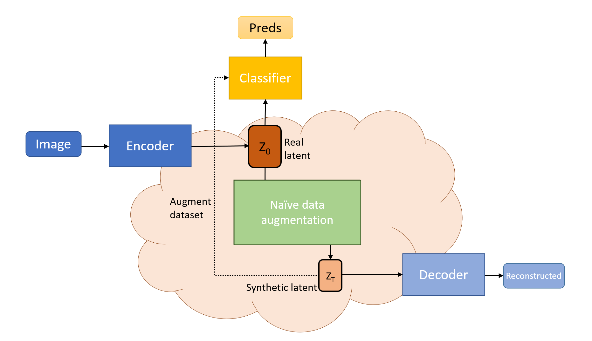
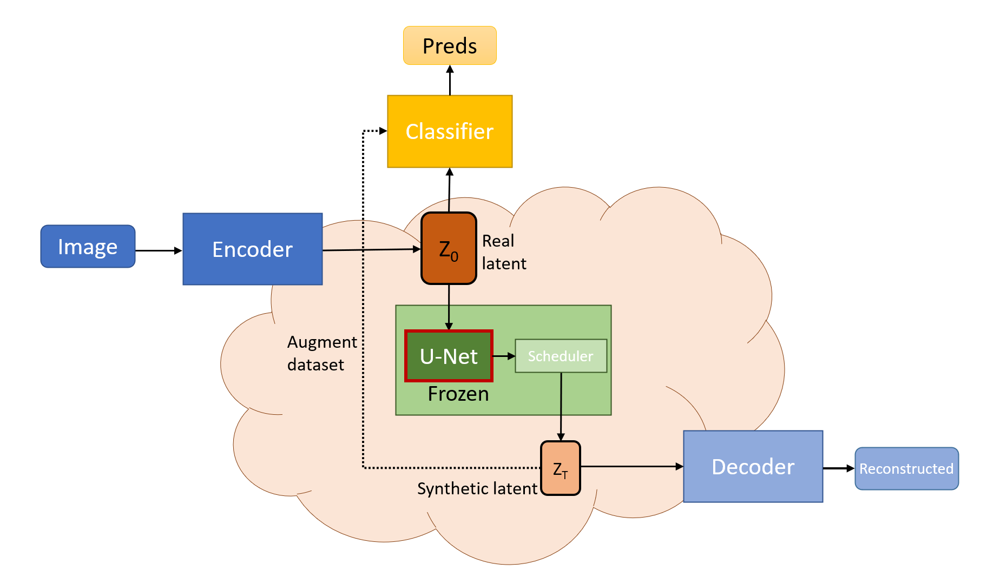
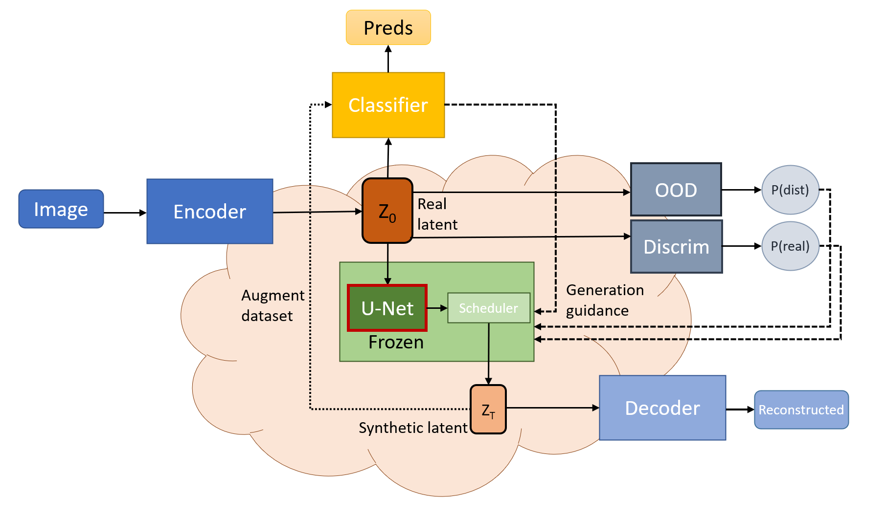

# Proof of concept

This document details the tasks and goals needed to complete the proof of concept phase of the project sucessfuly, while following the high level principles outlined in the project overview:

- Build a demo that showcases the project's value propositions. During this phase we focus on building an appealing "frontend" that helps stakeholders understand the value of the project.
- Experiment with simple yet potentially valuable approaches without training any DL models.
- Use the smallest datasets possible.
- Develop the analysis tools (metrics and visualizations) that we will need in the next phase.

## Project development

The key result that we consider for success is securing the project funding for 2023, and everything we do will be focused on achieving that goal. In order to accomplish it we allow the following tradeofs to achieve success quickly at the expense of accumulating a lot of technical debt that will be addressed during the next phase of the project:

- Focus on delivering demos and pitch deck slides.
- Prioritize experiments that allow for "nice reconstructions" that we can demo.
- Focus on achieving good performance to showcase the potential of our approach at the expense of generalization.
- Allow code duplications and hacks if that reduces iteration time.
- Iterate fast and pivot if needed to please stakeholders.
- Avoid scaling and generalization.

## Research

During the proof of concept we focus on understanding the latent representations of stable diffusion and evaluating
their potential to provide business value.

### Understanding SD VAE's latent representations

This involves building the necessary tools and running experiments to understand how we can generate high quality
synthetic data by leveraging stable diffusion:

- Evaluate reconstruction quality of latents.
- Understand the structure of the latent space manifold (Modalities, boundaries, continuity...)
- Understand how we can perturbate the latent space without decreasing image quality, and how well oversampling and
simple data augmentation techniques work on latent representations.
- Learn how to efficiently navigate the latent space to produce new synthetic images.

### Learning how to use stable diffusion to build performant classifiers

This involves experimentating with different approaches to use the latent space of stable diffusion to improve
model performance on classification tasks.

- Training different architectures using latent representations as inputs.
- Stablishing a common set of benchmarks to evaluate model performance.
- Evaluating the improvements of naive data augmentation techniques on model perfromance.
- Comparing model training on latent space vs training on reconstructed images.

## Milestones

### 1. Latent space analysis



#### Tasks

- Implement latent space analysis (metrics & embeddings).
- Implement reconstruction analysis (metrics & visualizations).
- Implement simple dataset of latent representations to conduct experiments.
- Develop a demo dashboard to analyze experiments.
- Improve dashboard to showcase business value to stakeholders & incorporate to pitch deck.

### 2. Simple data augmentation



#### Tasks

- Implement gaussian latent perturbations.
- Implement linear inversion.
- Implement linear interpolation of samples.
- Implement SMOTE oversampling on latent space.
- Develop demo dashboard to showcase the generated data and compare it to the original samples.
- Improve dashboard to showcase business value to stakeholders
- Incorporate findings to pitch deck.

#### Experiments

- Evaluate reconstructions of different augmentation techniques.
- Compare the quality of genered images following different approaches.
- Study the impact of different techinques on low dimensional embeddings and how much they deviate from the
original samples.

### 3. Latent classification



#### Tasks

- Train sklearn classifiers to serve as a simple baseline.
- Implement attention network to classify latent space.
- Develop dashboard to visualize attention layers.
- Implement 3 CV models to benchmark classification performance.
- Implement data augmentation pipeline.
- Benchmark performance of data augmentation in latent space.
- Benchmark data augmentation on generated images.
- Develop demo to highlight findings.
- Incorporate findings to pitch deck.

#### Experiments

- Benchmark sklearn classifiers.
- Benchmark attention network classifier.
- Evaluate the impact of the attention weights on latent space and how the latent features relate to image features
- Benchmark the effect of developed data augmentation techniques on classifier performance.
- Benchmark improvement on model metrics using reconstructed images.
- Train a classifier only using synthetic data and run benchmarks.

### 4. Sample-guided generation (AKA fancy interpolation)



#### Tasks

- Incorporate U-Net to generation pipeline.
- Implement gradient guidance with respect to metrics with respect to a target sample.
- Run experiments to evaluate different guidance metrics.
- Incorporate new generation techniques to the demo dashboards.
- Compare the performance of different schedulers.
- Incorporate findings to pitch deck.

#### Experiments

- Benchmark reconstructions with respect to naive approaches.
- Understand the trajectories un latent space that generated new samples.

### 5. Metric-guided generation (AKA custom data generation)



#### Tasks

- Implement discriminator.
- Implement out-of-distribution model.
- Incorporate model metrics as gradients to guided generation.
- Improve data generation benchmarking and evaluation.
- Incorporate new generation techniques to the demo dashboards.

#### Experiments

- Compare technique with sample-guided generation.

## Timeline

```{mermaid}
gantt
    title Synthetic data generation with diffusion models
    dateFormat  DD-MM-YY
    axisformat %d-%b-%y
    excludes  weekends, 01-11-22, 28-11-22, 29-11-22, 30-11-22, 01-12-22, 02-12-22, 05-12-22, 06-12-22, 07-12-22, 08-12-22, 09-12-22

    section Demos
    Latent Analysis                       :d1, 27-10-22, 3d
    Reconstructions                       :d2, after d1, 3d
    PoC pitch dashboard                   :milestone, m1, after d2, 2min
    Augmentation                          :d3, after d2, 3d
    PoC Data augmentation                 :milestone, m2, after d3, 2min
    Sample-guided generation              :d4, after d3, 5d
    MVP Data augmentation                 :milestone, m3, after d4, 2min
    Attention                             :d5, after d4, 2d
    PoC interpretability                  :milestone, m4, after d5, 2min
    Classification benchmarking           :d6, after d5, 5d
    PoC Performance                       :milestone, m5, after d6, 2min
    Synthetic training                    :d7, after d6, 5d
    PoC Compliance                        :milestone, m5, after d7, 10d

    section Experiments
    Simple generation                     :e1, 31-10-22, 3d
    Latent augmentation                   :e2, after e1, 5d
    Sample-guided generation              :e3, after e2, 3d
    Attention training                    :e4, after e3, 3d
    Model-guided data augmentation        :e5, after e4, 6d
    Synthetic training                    :e6, after c9, 3d

    section Project codebase
    Simple perturbations & interpolation  :c1, 26-10-22, 2d
    Latent augmentations                  :c2, after c1, 2d
    Guided interpolation                  :c3, after c2, 4d
    Classifier training                   :c4, after c3, 3d
    Attention analysis                    :c5, after c4, 2d
    Classifier tuning     :c6, after c5, 4d
    Improve dataset                       :c7, after c6, 2d
    Discriminator                         :c8, after c7, 2d
    OOD pipeline                          :c9, after c8, 2d

    section Vacations & disruptions
    Bcn Office   :v1, 03-11-22, 1d
    Traveling    :v2, 26-11-22, 2d
```

### Stage 0: Deliver a Proof of Concept

1. Write minimal reconstruction example notebook.
2. Implement simple perturbations & interpolation.
3. **Deliver reconstruction visualization & incorporate to pitch deck.**
4. Implement linear layer classifier training.
5. Implement linear inversion augmentation.
6. **Deliver inversion demo & incorporate to pitch deck.**
7. **Deliver improved Embedding dashboard & incorporate to pitch deck.**
8. Refine pitch deck demos & incorporate feedback.
9. **Deliver a demo dashboard & pitch deck material for the Nov 3rd demo.**
10. Onboard Javier and implement sample-guided interpolation.
11. **Deliver a demo for sample-guided interpolations & incorporate to pitch deck.**
12. Train simple cassifiers to stablish a baseline.
13. Train transformer classifier.
14. Implement attention raconstruction dashboard.
15. **Deliver attention demo & incorporate to pitch deck.**
16. Refine and benchmark classifier.
17. **Deliver classifier performance demo & incorporate to pitch deck.**
18. Implement better datasets.
19. Implement discriminator and Out of distribution model.
20. Implement metric-guided generation.
21. **Deliver metric-guided generation demo  & incorporate to pitch deck.**

### Stage 1: Develop an MVP

1. Create team DL library.
2. Refactor relevant code to shared library.
3. Refactor demos to use shared team's code.
4. Deploy "production demo".
